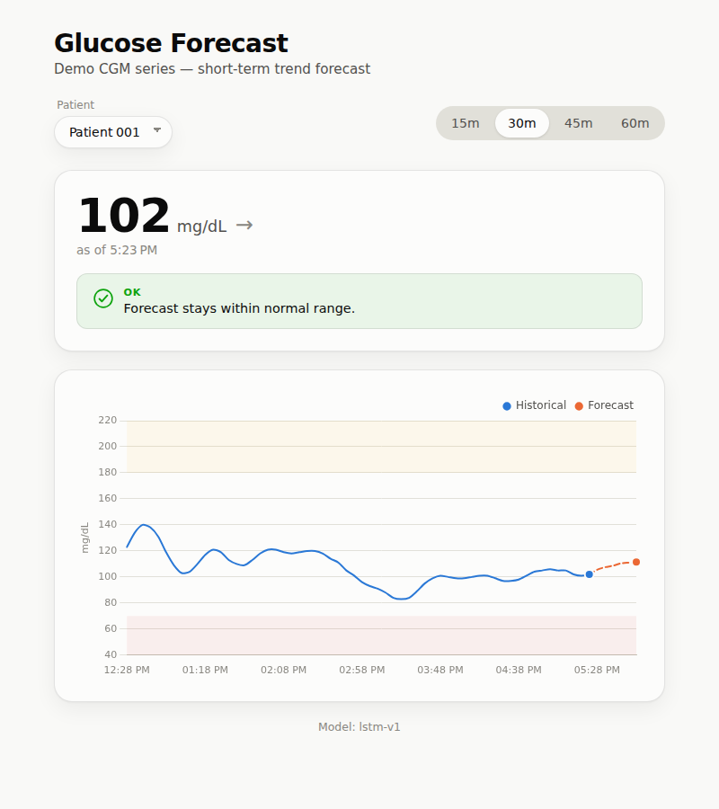
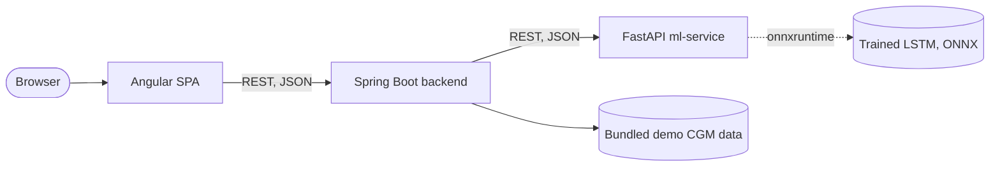

# Glucose Forecast Dashboard

<!-- TODO after pushing to GitHub: replace <owner>/<repo> below and add the live demo link -->
[](https://github.com/<owner>/<repo>/actions/workflows/ci.yml)
[](LICENSE)

A full-stack web app that turns a master's thesis on blood glucose forecasting
(LSTM/Transformer models, Python/Keras) into a working product: a trained
LSTM serves short-term glucose trend predictions through a Java/Spring
backend to an Angular dashboard, fully containerized and deployable.

**Live demo:** _add link here after deploying (see [docs/DEPLOY.md](docs/DEPLOY.md))_



## Why I built this

My thesis trained LSTM and Transformer models to forecast continuous glucose
monitor (CGM) readings. That work lived in notebooks. This project rebuilds
it as something a recruiter can actually click through: a real trained model,
served by a production-shaped architecture (polyglot microservices, Docker,
CI, automated tests), not just a script that prints an RMSE.

## What it does

1. Pick a demo patient's CGM history (real de-identified data, see
   [Dataset](#dataset--attribution))
2. The LSTM forecasts the next 15-60 minutes of glucose
3. Dashboard shows history + forecast on one chart, with hypo/hyperglycemia
   reference bands
4. A rule-based risk indicator (OK / WARNING / ALERT) flags concerning trends

## Results

The LSTM was trained on 13 participants and evaluated on 3 held out entirely
(never seen during training or validation):

| Model | Held-out RMSE (60 min ahead) |
|---|---|
| Persistence baseline (naive: "stays at last value") | 15.97 mg/dL |
| **LSTM (this project)** | **13.42 mg/dL** |

A ~16% improvement over the naive baseline, in line with published results
for univariate (CGM-only) short-horizon forecasting on comparably sized CGM
datasets. See [Limitations](#limitations--future-work) for what this model
deliberately does *not* account for.

## Architecture



- **Frontend** (Angular, standalone components) — dashboard, charting, no
  business logic
- **Backend** (Java 21, Spring Boot) — REST API, demo data, rule-based risk
  evaluation, orchestrates the ML call
- **ml-service** (Python, FastAPI) — serves the trained model via
  onnxruntime (no TensorFlow at inference time); falls back to a naive
  trend predictor if the model artifact fails to load
- Each service is an independent Docker image; `docker-compose.yml` wires
  them together locally, `render.yaml` deploys them to Render

## Tech stack

Java 21 · Spring Boot 4 · Angular 22 · TypeScript · Chart.js · Python ·
FastAPI · Keras/TensorFlow (training) · ONNX Runtime (serving) ·
scikit-learn · Docker · GitHub Actions

## Running locally

Requires Docker.

```bash
git clone <this-repo-url>
cd <repo>
docker compose up --build
```

- Dashboard: http://localhost:4200
- Backend API: http://localhost:8080/api/series
- ML service: http://localhost:8000/health

## Project structure

```
backend/          Spring Boot REST API
frontend/         Angular dashboard
ml-service/       FastAPI model server
  training/       Scripts to retrain the LSTM and export it to ONNX
data/demo/        Small bundled CGM subset (see Dataset below)
scripts/          Dataset download/extraction scripts
docs/             Dataset attribution, deploy guide, screenshots
render.yaml       Render Blueprint (deploy config)
```

## Retraining the model

```bash
python3 scripts/prepare_training_data.py      # downloads full CGM history (not committed)
pip install -r ml-service/training/requirements-training.txt
python3 ml-service/training/train_lstm.py     # trains, prints held-out RMSE
python3 ml-service/training/export_to_onnx.py # exports to ml-service/app/models/
```

## Limitations & Future Work

- **CGM-only (univariate) model** — no meal/carb or insulin input, matching
  the thesis's original scope. This is a known limitation for short-horizon
  glucose forecasting: the model can extrapolate a trend but is blind to
  the cause of a sudden change (a meal, a bolus) until it already shows up
  in the glucose curve. The source dataset does include food logs; adding
  them as a feature is a natural next step.
- **Small dataset** (16 participants, ~9 days each) — comparable to other
  published CGM forecasting studies, but not enough to claim strong
  generalization across a broader population.
- **Not a medical device.** Risk thresholds are simple, explainable rules
  (ADA-style hypo/hyperglycemia cutoffs) for demonstration purposes, not a
  validated clinical decision support tool.
- **Free-tier deploy**: services spin down after 15 minutes of inactivity;
  first request after idle takes ~30-60s to wake up.

## Dataset & Attribution

Uses a small subset of the **BIG IDEAs Lab Glycemic Variability and
Wearable Device Data** (PhysioNet), Open Data Commons Attribution License
v1.0. Full citation and licensing details in
[docs/DATASET.md](docs/DATASET.md). No real, identifiable patient data is
used — this is a public research dataset, already de-identified by its
authors.

## License

Code is MIT-licensed (see [LICENSE](LICENSE)). The demo dataset is
redistributed under its own license (ODC-By) — see
[docs/DATASET.md](docs/DATASET.md).
